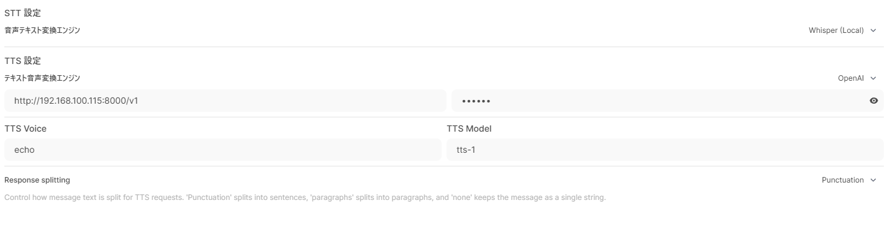

# OpenAPIbridge2VOICEVOX

[OpenAIのtext-to-speech API](https://platform.openai.com/docs/guides/text-to-speech)と、[VOICEVOX](https://github.com/VOICEVOX)のAPIを簡易的に変換するやつです。  
[Open WebUI](https://github.com/open-webui)のTTSでVOICEVOXが動くようにしただけなので、機能はそんなにありません。

## 要求物

|もの|用途|
|--|--|
|VOICEVOX|APIを叩くため|
|ffmpeg|pydubで使用、wavをmp3に変換する|
|Python|3.10を推奨|

APIさえ叩ければVOICEVOXはDockerのコンテナ等でも可です。  
また、VOICEVOX互換なら本家VOICEVOX以外の読み上げソフトでも動くと思い08:08 AMます。

## 使い方

直感的に動かせる設計にしてるので、敢えて読まなくても良いと思います。  

まずは、要求物をインストールします。上に書いてあるやつです。Pythonとffmpegはパスを通すのをお忘れなく。

VOICEVOXを起動した後に、`openwebui2voicevox_api_bridge.py`を実行してください。

```sh
pip install -r ./requirements.txt
python openwebui2voicevox_api_bridge.py
```

APIサーバーが起動したらOKです。  
何もいじってない場合、URLは`http://localhost:8000`です。  
なおAPIキーは不要です。好きな文字列をどうぞ。  
  
動作確認には`curl`が便利です。

```sh
curl -X POST http://localhost:8000/v1/audio/speech -H "Content-Type: application/json" -d '{ "input": "こんにちは。", "voice": "0", "model":"echo" }' --output "output.mp3"
```

`input`の欄に喋らせたい言葉を、`voice`の欄に喋らせたい話者のIDを入れてください。`model`は触らなくて構いません。

## Open WebUIでの使い方について

TTSの設定からOpenAIを指定し、URLを`http://localhost:8000/v1`に、TTS Voiceには話者のIDを入れてください。APIキーには好きな文字を(私は`000000`にしている)、TTS Modelはノータッチで構いません。



※画像の例ではDockerから接続しているためホストのローカルIPアドレスを使用しています。

## 設定

`settings.ini`で管理してます。  
項目名を見ればわかる設定しかありませんので、説明はカット。

## 話者のID

VOICEVOXの`/speakers`APIを叩いて、話者ごとのID一覧がわかるようにするための`speakers2csv.py`があります。  
出力はCLI上で確認してください。

## Todo

- 存在しない話者のIDを指定時のエラーハンドリングを追加
